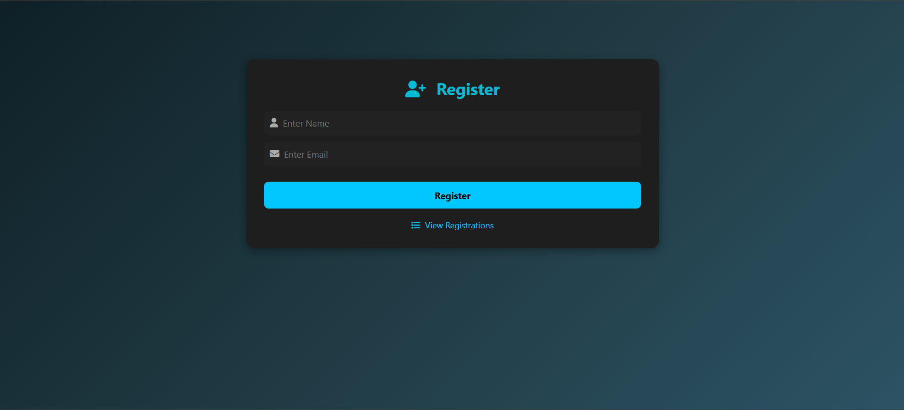
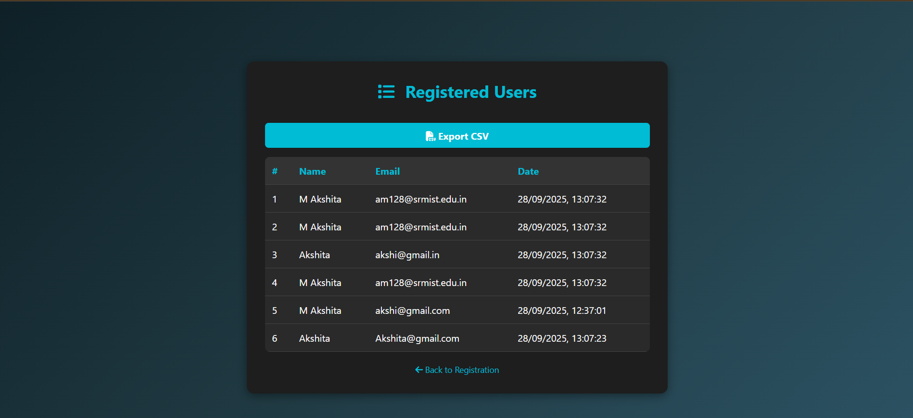

# 🎟️ Event Registration System

A modern **Event Registration System** with a dark-themed UI. Users can register their name and email, view all registrations, and export CSV files.

---

## ✨ Features

- 📝 **Register Users**: Enter Name and Email; date is recorded automatically.  
- 📋 **View Registrations**: View all registered users in a clean table.  
- 💾 **Export CSV**: Download all registrations as a CSV file.  
- 🔗 **Navigation**: Easy switch between Registration and View pages.  

---

## 🗂 Project Structure

event-registration/
├── index.html          # Registration page where users enter Name and Email
├── view.html           # Page to view all registered users and export CSV
├── style.css           # Shared CSS styles for both pages
├── screenshots/        # Folder containing screenshots for README
│   ├── registration.png
│   └── view.png
├── README.md           # Project documentation

---

## 🖼 Screenshots

### Registration Page

### View Registrations Page

---

## ⚙️ How to Use

1. Open `index.html` in a browser to register users.  
2. Open `view.html` to view registrations and export CSV.  
3. Optional backend for persistent storage (if implemented):
   - POST `/register` to save a user.  
   - GET `/registrations` to fetch all users.

---

## 🛠 Technologies Used

- HTML5 & CSS3  
- JavaScript (Vanilla)  
- Font Awesome (Icons)

---
